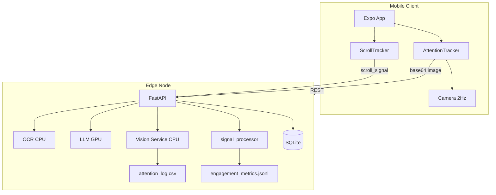

# EduSync: Edge AI-Powered Learning Analytics

## BTech ECE Final Year Project (12 Credits)

**Suggested Research Paper Title:**  
*Edge AI-Powered Learning Analytics: Vision-Based Attention and Multimodal Engagement*

**Research objectives:**

1. **Objective 1 — Edge AI performance and vision-based attention:** Demonstrate that an edge-deployed LMS achieves measurable inference performance (latency, throughput) for OCR and LLM operations, and vision-based head-pose attention monitoring with stable yaw/pitch/roll and binary attention state, with summary statistics and time-series/distribution figures.
2. **Objective 2 — Multimodal engagement and correlation with quiz performance:** Demonstrate that scroll-based engagement (DSP) and vision-based attention (focused ratio) correlate with quiz score across multiple users/sessions, with scatter plots and Pearson correlation (N sufficient for a short conference paper).

---

## Abstract

EduSync is an AI-enhanced Learning Management System designed to run on an edge node (local server or laptop) rather than in the cloud. The system uses a dual-model architecture: a CPU-bound OCR engine (EasyOCR/PyPDF2) for extracting text from study materials, and a GPU-bound Large Language Model (Llama-3) for generating summaries, flashcards, and quizzes. Student attention during quizzes is quantified using vision-based head pose estimation: the device camera captures frames at 2 Hz, and head orientation (yaw, pitch, roll) is computed via MediaPipe Face Mesh and cv2.solvePnP. The vision pipeline runs on CPU to leave the GPU free for Llama-3. Attention is scored from head stability (e.g., abs(yaw) > 20° or abs(pitch) > 15° indicates distraction). Scroll engagement during material viewing is quantified via DSP (FIR, energy, ZCR) into a Scroll Engagement Score (0–100). All processing is performed locally, reducing latency and preserving privacy. This report describes the system architecture, the vision-based attention and DSP engagement methodology, and presents results for inference performance, attention metrics, and correlation of engagement/attention with quiz scores.

---

## System Architecture

**Pipelines:**

1. **Material pipeline:** Teacher uploads PDF/image → OCR extracts text → stored in DB; same text is sent to LLM for summary, flashcards, and quiz generation.
2. **Intelligence pipeline:** Extracted text → Llama-3 (GPU) → JSON/summary output; metrics (inference time, input/output size) are logged for research.
3. **Attention pipeline (vision):** During quizzes, camera captures frames at 2 Hz → Vision Service (MediaPipe + solvePnP + Moving Average smoothing) → `attention_log.csv`.
4. **Scroll pipeline (behavior):** During material viewing, scroll tracked at 1 Hz → DSP (FIR, ZCR, FFT) → Scroll Engagement Score → `engagement_metrics.jsonl`.

---

## Methodology

### Vision Model

- **Input:** Base64-encoded camera frame from front-facing camera, captured every 2 seconds during quiz.
- **Face detection:** MediaPipe Face Mesh with `min_detection_confidence=0.5` (CPU-only).

### Vision Steps (Attention Detection)

1. **2D face landmarks:** Extract nose tip, chin, left/right eye corners, and mouth corners from MediaPipe.
2. **3D face model:** Map 2D image points to a generic 3D face model (canonical coordinates).
3. **solvePnP:** Use `cv2.solvePnP` to estimate rotation vector from 2D–3D point correspondences.
4. **Euler angles:** Convert rotation vector to yaw, pitch, roll (degrees).
5. **Moving Average smoothing:** A per-student buffer stores the last N frames (default 10) of yaw and pitch. The threshold is applied to the *averaged* values, reducing false positives from single-frame noise.
6. **Attention rule:** If \( |\text{yaw}_{avg}| > 20° \) or \( |\text{pitch}_{avg}| > 15° \), then attention_state = 0 (distracted); else attention_state = 1 (focused).
7. **Data logging:** Each sample appended to `attention_log.csv` with `timestamp`, `timestamp_iso`, `student_id`, `yaw`, `pitch`, `roll`, `attention_state`, `assignment_id`.

### Multimodal Engagement Tracking (Vision + Behavior)

EduSync tracks engagement from two modalities:
- **Vision:** Head pose during quizzes → `attention_log.csv` (smoothed yaw/pitch, attention_state).
- **Behavior:** Scroll velocity during material viewing → DSP pipeline (FIR filter, energy, ZCR, FFT) → Scroll Engagement Score (0–100) → `engagement_metrics.jsonl`.

Both logs include timestamps and user identifiers (`student_id` / `user_id`) for side-by-side correlation analysis in research.

### Edge vs Cloud (Qualitative)

- **Latency:** Edge inference avoids round-trip to cloud; suitable for interactive quiz/summary generation.
- **Privacy:** User content and camera frames stay on the edge node.
- **Cost:** No per-request API cost; hardware (GPU) is one-time.
- **Scope:** This report does not implement a cloud baseline; comparison with cloud APIs can be discussed qualitatively or added in future work.

---

## Data collection / evaluation data

Metrics are collected from real app usage (inference, attention, scroll engagement). For scalable evaluation and conference paper results when multi-user testing is not feasible, **synthetic multi-user data** can be generated: run `backend/scripts/generate_synthetic_research_data.py` (reproducible with **seed 42**). This script seeds the DB with synthetic users, classrooms, materials, assignments, and quiz submissions, and overwrites `backend/research_data/attention_log.csv` and `backend/research_data/engagement_metrics.jsonl` with data designed so engagement and attention correlate with quiz score. Then run `export_research_csv.py`, `analyze_attention.py`, and `visualize_research_data.py` to produce CSVs and figures. Optionally backup `research_data/` and `edusync.db` before generating synthetic data.

---

## Results

### Table 1: Inference Performance (Edge AI)

Fill from `backend/research_data/inference_metrics.csv` (or aggregate from `inference_metrics.jsonl`). Export: `backend/scripts/export_research_csv.py`. Latency percentiles: `backend/research_data/latency_percentiles.csv`.

| Operation   | Count | Avg duration (ms) | Avg input (chars) | Avg output (chars) | Chars/s |
|------------|-------|-------------------|-------------------|--------------------|--------|
| OCR        | …     | …                 | …                 | …                  | …      |
| Summary    | …     | …                 | …                 | …                  | …      |
| Flashcards | …     | …                 | …                 | …                  | …      |
| Quiz       | …     | …                 | …                 | …                  | …      |

### Table 2: Attention Metrics (Vision)

Fill from `backend/research_data/attention_log.csv`; summary stats are printed by `backend/scripts/analyze_attention.py` and written to `attention_summary.csv`.

| Metric         | Mean | Std | Min | Max |
|----------------|------|-----|-----|-----|
| Yaw (deg)      | …    | …   | …   | …   |
| Pitch (deg)    | …    | …   | …   | …   |
| Roll (deg)     | …    | …   | …   | …   |
| Focused ratio  | …    | …   | …   | …   |

### Figures

All figures are generated in `backend/research_data/figures/` by `backend/scripts/visualize_research_data.py`:

- **engagement_vs_quiz_scatter.png** — Scatter: avg engagement score vs quiz score, with linear fit and Pearson r.
- **engagement_distribution.png** — Histogram of engagement scores (sessions).
- **latency_by_operation.png** — Bar chart of latency (avg/p50) per operation.
- **attention_timeseries.png** — Yaw and pitch vs time for a sample quiz session.
- **attention_distribution.png** — Histograms of yaw, pitch, focused ratio per student, and attention state counts.
- **attention_vs_quiz_scatter.png** — Scatter: focused ratio vs quiz score, with linear fit and Pearson r.

---

## References

1. Learning Analytics: review of literature (e.g., Siemens & Long, 2011; or institution-provided survey).
2. Edge AI / on-device inference: survey or industry report on edge ML.
3. Head pose estimation: MediaPipe Face Mesh, solvePnP / PnP problem references.
4. Attention monitoring: papers on vision-based engagement or focus detection.
5. Llama / open-weight LLMs: Meta Llama model card or relevant technical report.

---

## Repository Notes

- **Backend:** `backend/` (FastAPI, LLM, OCR, Vision Service, metrics logging).
- **Frontend:** `EduSyncApp/` (Expo/React Native, AttentionTracker during quizzes).
- **Research data:** `backend/research_data/` (JSONL, `attention_log.csv`); export to CSV via `backend/scripts/export_research_csv.py`.
- **API:** `GET /research/metrics-summary` returns aggregated inference stats; `POST /analyze-attention` receives camera frames and logs to `attention_log.csv`.
