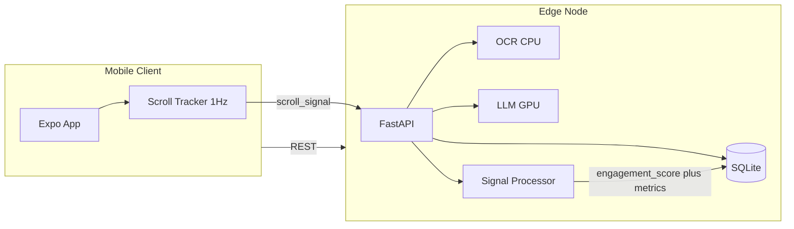

# EduSync: Edge AI-Powered Learning Analytics

## BTech ECE Final Year Project (12 Credits)

**Suggested Research Paper Title:**  
*Edge AI-Powered Learning Analytics: A Digital Signal Processing Approach for Real-Time Student Engagement Detection*

---

## Abstract

EduSync is an AI-enhanced Learning Management System designed to run on an edge node (local server or laptop) rather than in the cloud. The system uses a dual-model architecture: a CPU-bound OCR engine (EasyOCR/PyPDF2) for extracting text from study materials, and a GPU-bound Large Language Model (Llama-3) for generating summaries, flashcards, and quizzes. Student engagement is inferred from scroll behavior using digital signal processing: the scroll delta is treated as a discrete-time signal sampled at 1 Hz, and engagement is estimated via FIR low-pass filtering, signal energy, zero-crossing rate, and FFT-based spectral analysis. All processing is performed locally, reducing latency and preserving privacy. This report describes the system architecture, the DSP-based engagement detection methodology, and presents results for inference performance and engagement metrics.

---

## System Architecture

**Pipelines:**

1. **Material pipeline:** Teacher uploads PDF/image → OCR extracts text → stored in DB; same text is sent to LLM for summary, flashcards, and quiz generation.
2. **Intelligence pipeline:** Extracted text → Llama-3 (GPU) → JSON/summary output; metrics (inference time, input/output size) are logged for research.
3. **Analytics pipeline:** Mobile app samples scroll delta at 1 Hz → raw signal sent to backend → DSP module computes engagement score and metrics (energy, ZCR, FFT, reading ratio) → stored in `LearningSession` and logged for research.

---

## Methodology

### Signal Model

- **Discrete-time signal:** Scroll delta (pixels moved per second) is sampled once per second on the client, yielding a sequence \( x[n] \) with sampling frequency \( f_s = 1 \) Hz.
- **Units:** Each sample is in pixels per second (px/s), representing instantaneous scroll activity.

### DSP Steps (Engagement Detection)

1. **FIR low-pass filter:** A 5-tap moving-average filter smooths the raw signal to reduce noise and short spikes; filtered signal is used for reading-band detection.
2. **Signal energy:** \( E = \frac{1}{N} \sum_n x[n]^2 \) (normalized by length); used as an activity-level feature.
3. **Zero-crossing rate (ZCR):** Rate of sign changes around the mean; high ZCR suggests oscillating (active) scrolling, low ZCR suggests idle or steady scroll.
4. **FFT / dominant frequency:** Magnitude spectrum of \( x[n] \); dominant frequency (excluding DC) characterizes periodic components in scroll behavior.
5. **Reading band:** Filtered signal in the range 5–100 px/s is classified as “reading”; below 5 px/s as “idle,” above 100 px/s as “skimming.” The fraction of samples in the reading band is the *reading ratio*.
6. **Score formula:** Engagement score (0–100) is a weighted combination of reading ratio (base), normalized energy (bonus), and ZCR-based activity term; details are in `backend/signal_processor.py`.

### Edge vs Cloud (Qualitative)

- **Latency:** Edge inference avoids round-trip to cloud; suitable for interactive quiz/summary generation.
- **Privacy:** User content and scroll signals stay on the edge node.
- **Cost:** No per-request API cost; hardware (GPU) is one-time.
- **Scope:** This report does not implement a cloud baseline; comparison with cloud APIs can be discussed qualitatively or added in future work.

---

## Results

### Table 1: Inference Performance (Edge AI)

*(Fill using exported data from `backend/research_data/` after running the system. Use `backend/scripts/export_research_csv.py` to generate `inference_metrics.csv`.)*

| Operation   | Count | Avg duration (ms) | Avg input (chars) | Avg output (chars) | Chars/s |
|------------|-------|-------------------|-------------------|--------------------|--------|
| OCR        | …     | …                 | …                 | …                  | …      |
| Summary    | …     | …                 | …                 | …                  | …      |
| Flashcards | …     | …                 | …                 | …                  | …      |
| Quiz       | …     | …                 | …                 | …                  | …      |

### Table 2: Engagement Metrics (DSP)

*(Fill using `engagement_metrics.csv` from the export script.)*

| Metric          | Mean | Std | Min | Max |
|-----------------|------|-----|-----|-----|
| Engagement score| …    | …   | …   | …   |
| Reading ratio   | …    | …   | …   | …   |
| Energy          | …    | …   | …   | …   |
| ZCR             | …    | …   | …   | …   |
| Dominant freq (Hz) | … | …   | …   | …   |

### Figures (Optional)

- **Signal waveform:** Plot of a sample scroll signal \( x[n] \) (time vs px/s).
- **FFT magnitude:** One-sided magnitude spectrum for the same signal, showing dominant frequency.

---

## References

1. Learning Analytics: review of literature (e.g., Siemens & Long, 2011; or institution-provided survey).
2. Edge AI / on-device inference: survey or industry report on edge ML.
3. Digital signal processing: standard textbook (e.g., Oppenheim & Schafer) for FIR, FFT, ZCR.
4. HCI / scroll-based behavior: papers on scroll or reading behavior detection if used.
5. Llama / open-weight LLMs: Meta Llama model card or relevant technical report.

---

## Repository Notes

- **Backend:** `backend/` (FastAPI, LLM, OCR, DSP, metrics logging).
- **Frontend:** `EduSyncApp/` (Expo/React Native, scroll tracker at 1 Hz).
- **Research data:** `backend/research_data/` (JSONL); export to CSV via `backend/scripts/export_research_csv.py`.
- **API:** `GET /research/metrics-summary` returns aggregated inference and engagement stats.
